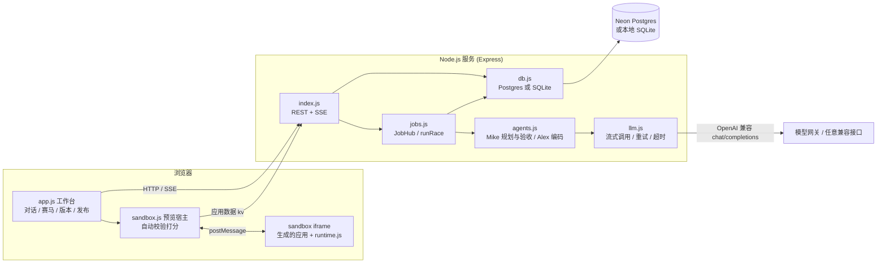

# Atoms Demo

用一句话描述需求，由智能体团队（Mike 拆解需求并验收，Alex 编码）驱动多个模型并行生成可运行的网页应用，在浏览器里实时查看、自动校验打分、择优采用，并支持对话迭代、版本回退和一键发布分享。

- 在线地址：<https://atoms-demo-i0h8.onrender.com>
- 代码仓库：<https://github.com/dong161/atoms-demo>
- 详细设计与取舍：[docs/说明文档.md](docs/说明文档.md)

## 核心功能

| 能力 | 说明 |
| --- | --- |
| 一句话生成应用 | 输入需求后，Mike 先产出开发说明（应用名、功能清单、设计、数据），Alex 据此生成单文件 HTML 应用 |
| 多模型赛马 | 同一需求最多 3 路模型并行生成，界面实时显示各路进度与代码输出；也可关闭赛马只用单模型 |
| 自动校验打分（满分 100） | 浏览器沙箱实测 50 分（渲染、无报错、交互、持久化、移动端）+ Mike 对照需求逐条验收 40 分 + 代码完整性 10 分 |
| 应用查看器 | 沙箱 iframe 中可直接操作生成的应用；桌面/手机视图切换、刷新、Console 面板、新标签页打开 |
| 对话迭代 | 在当前版本上继续提修改要求，修改同样可以赛马 |
| 版本管理 | 每次采用或回退都生成新版本；回退是「复制旧版本为新版本」，历史不丢失 |
| 数据持久化 | 生成应用里的 localStorage 自动同步到云端数据库，刷新、换设备都在 |
| 发布与分享 | 一键发布得到 `/s/<slug>` 链接；每位访客的数据相互隔离；可「更新发布」 |
| 账号与初始化 | 邮箱密码注册/登录（scrypt），保留昵称与恢复码；三步首次引导、错误反馈、可关闭弹窗 |
| 稳定性 | 任务在服务端运行，刷新页面不中断、可续上进度；流中断/截断自动重试；单路失败不影响其它路 |
| 演示模式 | 不配置模型时自动使用内置模板（看板 / 个人主页 / 房贷计算器），完整流程照样可体验 |

## 3 分钟快速体验

1. 打开在线地址，输入昵称点「开始使用」（无需密码或邮箱）。
2. 点击示例「房贷计算器」，或自己写一句需求，保持「赛马模式」开启，点发送。
3. 在左侧对话里看到 Mike 的需求拆解卡片；右侧赛马面板里能看到每一路模型的字数和代码流式输出（推理型模型会显示「思考中，已用时」）。
4. 候选陆续完成后，会自动在沙箱里点击、填写并打分；展开「Mike 验收」可看到逐条需求是否满足。点「全屏试用」亲手操作，再点「采用此版本」。
5. 在应用里新增一条数据并刷新页面，数据仍然在。
6. 在对话框输入「主色换成蓝色」之类的修改要求，生成 Version 2；打开右上角「版本历史」，可预览并「回退到此版本」。
7. 点「发布」复制链接，在无痕窗口打开：访客可直接使用，并拥有独立于你的数据。

提示：线上模型生成一次通常需要一到几分钟，页面可以刷新或离开，回来后会自动续上。

## 架构



## 技术栈

- 后端：Node.js 22.5+、Express 4，依赖仅 `express` 与 `pg`
- 数据库：线上 Postgres（Neon）；本地使用 Node 内置 `node:sqlite`，由同一个适配层 `server/db.js` 屏蔽差异
- 前端：原生 ES Modules，无构建步骤、无框架
- 实时通信：Server-Sent Events（SSE），支持断线后回放
- 模型接入：任意 OpenAI 兼容的 `/chat/completions` 流式接口
- 测试：`node --test`（61 个用例）；CI 为 GitHub Actions
- 部署：Render（Free）+ Neon

## 本地运行

要求 Node.js 22.5 及以上。

```bash
npm install
cp .env.example .env   # 不填任何模型配置也能运行，自动进入演示模式
npm start              # http://localhost:3100
npm test               # 61 个测试，使用内存 SQLite 与 mock 模型，不访问外部服务
```

不配置 `LLM_*` 时为演示模式：流程完整可用（拆解、赛马、校验、采用、迭代、回退、发布），但生成结果来自 `server/mock/` 下的三个内置模板，修改也只支持换主色和深色模式。配置 `LLM_BASE_URL`、`LLM_MODELS` 后即使用真实模型。本地未设置 `DATABASE_URL` 时数据保存在 `data/atoms-demo.db`。

## 环境变量

| 变量 | 必填 | 说明 |
| --- | --- | --- |
| `PORT` | 否 | 监听端口，默认 `3100`（Render 会自动注入） |
| `DATABASE_URL` | 线上必填 | Postgres 连接串；留空则使用本地 SQLite 文件 `data/atoms-demo.db` |
| `LLM_BASE_URL` | 否 | OpenAI 兼容接口地址（到 `/v1` 为止），请求 `${LLM_BASE_URL}/chat/completions` |
| `LLM_API_KEY` | 否 | 接口密钥，作为 Bearer 令牌发送 |
| `LLM_MODELS` | 否 | 赛马可选模型，逗号分隔；前 3 个为默认赛马阵容 |
| `LLM_PLANNER_MODEL` | 否 | Mike 拆解需求与验收所用模型，默认取 `LLM_MODELS` 的第一个 |
| `MOCK_MODE` | 否 | 设为 `1` 强制演示模式；`LLM_BASE_URL` 或 `LLM_MODELS` 为空时也自动进入演示模式 |
| `NODE_ENV` | 否 | 为 `production` 时不读取 `.env` 文件，其余情况启动时会尝试加载根目录 `.env` |

`.env` 已在 `.gitignore` 中，请不要提交密钥。

## 目录结构

```text
.
├── server/
│   ├── index.js        Express 应用：账号、项目、任务事件流、版本、发布、应用数据 kv
│   ├── jobs.js         任务调度：JobHub（事件缓冲与回放）、runRace（赛马）、采用与版本创建
│   ├── agents.js       Mike（拆解 / 验收）与 Alex（编码）的提示词、解析与 mock 实现
│   ├── llm.js          OpenAI 兼容流式客户端：超时、重试、截断识别
│   ├── html.js         模型输出清洗（去围栏）与静态完整性检查
│   ├── db.js           数据库适配层（Postgres / SQLite）与表结构
│   └── mock/           演示模式的三个内置应用模板
├── public/
│   ├── index.html      工作台入口
│   ├── share.html      发布页与所有者新标签预览页
│   ├── css/style.css
│   └── js/
│       ├── app.js      前端主程序：账号、对话、赛马、预览、版本、发布
│       ├── sandbox.js  预览宿主：注入运行时、数据同步、自动校验与评分
│       └── runtime.js  注入生成应用内的运行时：localStorage 替身、报错收集、探针
├── test/               agents / api / html / llm 四组测试
├── docs/说明文档.md     实现思路、完成度与后续规划
├── render.yaml         Render 部署配置
└── .github/workflows/  test.yml（push 与 PR 跑测试）、keepalive.yml（每 10 分钟保活）
```

## 部署

线上环境为 Render 免费实例（Ohio）加 Neon Postgres（us-east-2）。

1. 在 Neon 创建数据库，取得连接串。启动时服务会自动建表（`CREATE TABLE IF NOT EXISTS`），无需手动迁移。
2. 在 Render 通过 `render.yaml` 创建 Web Service（`npm ci` 构建、`npm start` 启动、健康检查 `/api/health`）。
3. 在 Render 控制台填写 `DATABASE_URL`、`LLM_BASE_URL`、`LLM_API_KEY`、`LLM_MODELS`、`LLM_PLANNER_MODEL`（这些变量在 `render.yaml` 中为 `sync: false`，不会进入仓库）。
4. Render 免费实例闲置约 15 分钟会休眠，`.github/workflows/keepalive.yml` 每 10 分钟请求一次 `/api/health` 保活，同时作为可用性监控。如果 fork 本仓库，请把其中的域名改成自己的。

线上模型通过作者本机的一个模型网关接入（只放行对话补全接口、限定模型白名单、独立令牌、并发上限），经隧道转发，上游服务不直接暴露；该网关不在本仓库内。任何 OpenAI 兼容接口都可以替代它。

## 文档

实现思路、关键取舍、评分与安全设计、完成度和后续规划见 [docs/说明文档.md](docs/说明文档.md)。

## 首页与账号更新（2026-10-09）

首页加入官网远程人物图与明确标注的设计参考图，自写渐变与悬浮动效、响应式布局及减少动态效果支持。来源与使用范围见 [素材来源](docs/素材来源.md)。

真实邮箱密码接口：`POST /api/auth/register`（name/email/password）、`POST /api/auth/login`（email/password）。密码10–128字符，经随机盐scrypt存储；登录签发7天会话；注册恢复码及旧昵称令牌继续兼容。邮箱仅作为账号标识，**没有邮件验证、邮件找回、第三方登录**。旧库自动增加可空邮箱/密码字段及sessions表，迁移可重复执行。首次引导不自动调用模型。

### GitHub 保活（2026-10-09）

`.github/workflows/keepalive.yml` 每5分钟尽力访问 Render 的 `/api/health`，错开整点，保留手动触发并在保活配置变化时立即执行。脚本不仅检查HTTP成功，还要求JSON `ok=true`、数据库postgres；避免把Render返回HTTP200的唤醒页面误报健康。失败最多重试3次，单请求60秒、间隔10秒；任务5分钟超时，只读仓库权限。

GitHub schedule可能延迟或丢弃，**不能保证永不休眠**。Render免费实例15分钟无流量会休眠，唤醒约1分钟；免费运行时数为工作区共享750小时/月。持续保活会消耗运行额度。可靠免冷启动需另选常驻服务方案，本项目未自动购买付费实例。

### 主题与文本附件
- 输入框加号包含真实的文本附件和赛马/模型设置；主题提供自由创作、静谧自然、陶土暖色、极简黑白、清透蓝色。
- 主题用于下次创建或修改生成应用，进入工程模型系统提示并补充确定性的 CSS，不改变原有业务逻辑和存储键。
- TXT/Markdown/JSON 按参考文本读取；最多 3 个，每个最多 8000 字符且 32KB，总计最多 16000 字符且 64KB。不支持图片/PDF。附件会发送给模型，不要上传密码、密钥或敏感信息。
- 创建/修改接口接受 `themeId` 和 `attachments: [{name,text}]`；项目保存 `theme_id`、`attachments`。修改不传这两个字段则继承，传空附件数组则清除。旧数据库使用增量迁移。
- 首页选项保存在当前浏览器会话，项目内选项持久化在数据库；主题选择仅在下次提交生效。附件作为不可信参考资料编码传入，不赋予系统指令权限。
