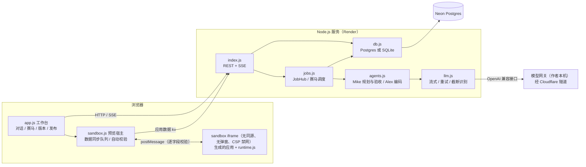

# Atoms Demo

用一句话描述想要的应用，由 AI 智能体团队（Mike 拆解需求并验收、Alex 编码）驱动**多个模型并行生成**可运行的网页应用；在浏览器沙箱里实时预览、**自动实测打分**、择优采用，再通过对话、点选元素、一键修复继续迭代，版本可回退、可 Remix，一键发布分享。

- 在线体验：<https://atoms-demo-i0h8.onrender.com>
- 不想等生成？直接用成品：[项目任务看板](https://atoms-demo-i0h8.onrender.com/s/Db5GK2OY) · [每日喝水打卡](https://atoms-demo-i0h8.onrender.com/s/doS6R8zF)
- 演示视频（2 分钟，真实模型线上录制，等待片段已加速）：[docs/media/demo.mp4](docs/media/demo.mp4)
- 设计说明（思路、取舍、完成度、扩展规划）：[docs/说明文档.md](docs/说明文档.md)

## 核心功能

| 能力 | 说明 |
| --- | --- |
| 一句话生成应用 | Mike 先把需求拆成开发说明（应用名、功能清单、设计、数据），Alex 据此生成单文件 HTML 应用 |
| 多模型赛马 | 同一需求最多 3 路模型并行，实时显示每一路的进度与流式代码；可自选模型或关闭赛马 |
| 自动校验打分（100 分） | 浏览器沙箱实测 50 分（渲染 / 报错 / 真实点击交互 / 持久化 / 375px 适配）+ Mike 逐条对照需求验收 40 分 + 代码完整性 10 分，推荐最优候选 |
| 应用查看器 | 沙箱 iframe 中直接操作生成的应用；桌面/手机视图、刷新、Console、新标签页打开 |
| 对话迭代 | 在当前版本上继续提修改，修改同样可以赛马 |
| 点选修改 | 工具栏「选择元素」→ 在预览里点中某个元素 → 只修改它（对应 Atoms 的 Design / Select to Chat） |
| 一键修复 | 预览出现运行报错时，「让 Alex 修复」把报错交给模型定位修复（对应 Atoms 的 Resolve） |
| 版本与 Remix | 每次采用/回退都生成新版本；可预览、回退任意历史版本，或把它 Remix 成独立新项目（可选复制数据） |
| 主题与附件 | 5 套主题真实影响生成应用的配色与样式；可上传 TXT / Markdown / JSON 需求文档作为参考 |
| 数据持久化 | 生成应用的 localStorage 自动同步到云端数据库，刷新、换设备都在；同步失败自动重试 |
| 发布与分享 | 一键发布 `/s/<slug>` 链接，每位访客的数据相互隔离；可更新发布、取消发布 |
| 账号与初始化 | 邮箱 + 密码注册登录，或仅用昵称快速体验（恢复码换设备）；三步首次引导 |
| 稳定性 | 任务在服务端运行，刷新/断网后自动续上；截断/中断自动重试；单路失败不影响其它路；无模型时演示模式兜底 |

## 3 分钟快速体验

1. 打开在线地址，点「开始使用」：用邮箱注册，或选「仅用昵称快速体验」。
2. 点一个示例（如「房贷计算器」）或自己写一句需求，保持赛马开启，发送。
3. 左侧对话里看到 Mike 的需求拆解；右侧赛马面板实时显示每一路模型的代码输出。
4. 完成后系统自动在沙箱里点击、填写、量尺寸并打分，展开「Mike 验收」看逐条需求是否满足。点「全屏试用」亲手操作，再「采用此版本」。
5. 在应用里新增数据并刷新页面，数据仍在。
6. 对话里输入「主色换成绿色」；或点工具栏「选择元素」，点中一个按钮，再说「改成圆角大按钮」。
7. 「版本历史」里预览旧版本、回退，或 Remix 成新项目。
8. 「发布」后用无痕窗口打开链接：访客可直接使用，数据独立于你。

线上生成一次通常需要 1~3 分钟，期间可以刷新或离开页面，回来后会自动续上。

## 架构



一次生成的流程：`POST /api/projects` → 服务端创建任务 → Mike 拆解需求 → N 路 Alex 并行生成（SSE 实时推送进度）→ 每路完成后 Mike 对照需求验收 → 浏览器在离屏沙箱里实测打分 → 用户采用 → 生成版本。

## 技术栈

- 后端：Node.js 22.5+、Express 4，运行时依赖只有 `express` 和 `pg`
- 数据库：线上 Neon Postgres；本地默认用 Node 内置 `node:sqlite`，`server/db.js` 屏蔽差异
- 前端：原生 ES Modules，无框架、无构建步骤
- 实时：Server-Sent Events，令牌走请求头，断线续传
- 模型：任意 OpenAI 兼容的 `/chat/completions` 流式接口
- 质量：78 个 `node:test` 用例 + Prettier 格式检查，GitHub Actions 在每次 push 时运行；`scripts/smoke-ui.mjs` 用真实浏览器在线上逐项验收（19 项，含持久化、访客隔离、Remix、移动端），最近一次 19/19 通过
- 部署：Render 免费实例 + Neon；GitHub Actions 每 5 分钟保活

## 本地运行

需要 Node.js 22.5 及以上。

```bash
npm install
cp .env.example .env   # 不填模型配置也能运行，自动进入演示模式
npm start              # http://localhost:3100
npm test               # 78 个测试：内存 SQLite + mock 模型，不访问外部服务
npm run format:check
```

不配置 `LLM_*` 时为演示模式：拆解、赛马、校验、采用、迭代、回退、发布全流程可用，生成结果来自 `server/mock/` 的三个内置模板。配置 `LLM_BASE_URL`、`LLM_MODELS` 后使用真实模型。未设置 `DATABASE_URL` 时数据保存在 `data/atoms-demo.db`。

## 环境变量

| 变量 | 说明 |
| --- | --- |
| `PORT` | 监听端口，默认 `3100`（Render 自动注入） |
| `DATABASE_URL` | Postgres 连接串；留空用本地 SQLite |
| `LLM_BASE_URL` | OpenAI 兼容接口地址（到 `/v1`） |
| `LLM_API_KEY` | 接口密钥（Bearer） |
| `LLM_MODELS` | 可选模型，逗号分隔；前 3 个为默认赛马阵容 |
| `LLM_PLANNER_MODEL` | Mike 拆解与验收用的模型，默认取第一个 |
| `MOCK_MODE` | 设为 `1` 强制演示模式 |

## 目录结构

```text
server/
  index.js            Express：账号、项目、任务事件流、版本、Remix、发布、应用数据、模型地址上报
  jobs.js             JobHub（事件序号/回放/任务槽）、赛马调度、采用与版本号分配
  agents.js           Mike（拆解/验收）与 Alex（编码）的提示词、解析、截断识别、mock 实现
  llm.js              OpenAI 兼容流式客户端：超时、可取消重试、中断识别
  edit-context.js     点选元素 / 控制台报错等修改上下文（只发给模型）
  generation-options.js  主题与附件
  html.js / db.js     输出清洗与静态检查 / 数据库适配层
  mock/               演示模式模板
public/
  index.html, share.html（发布页与新标签预览）, css/, img/（AI 原创素材）
  js/app.js           前端入口：路由与启动
  js/core.js          基础工具、全局状态、API 请求
  js/auth.js          账号：注册 / 登录 / 恢复码、首次引导
  js/home.js          首页：落地页、输入框、示例、我的项目
  js/workspace.js     工作区：项目加载、对话、输入框、任务事件流
  js/preview.js       预览区：应用查看器、Console、点选修改、一键修复
  js/race.js          赛马对比：候选卡片、缩略图、自动校验打分
  js/actions.js       项目操作：采用、回退、Remix、下载、发布、版本历史
  js/sandbox.js       预览宿主：注入运行时、数据同步队列、自动校验评分
  js/runtime.js       注入生成应用的运行时：localStorage 替身、报错收集、点选、探针
ops/model-gateway/    本机模型网关与隧道守护脚本（不含配置与密钥）
test/                 78 个测试
docs/                 说明文档、素材来源
```

## 部署

1. Neon 创建数据库；服务启动时自动建表和增量迁移。
2. Render 用 `render.yaml` 创建 Web Service（健康检查 `/api/health`，返回当前提交号），在控制台填写环境变量（`sync: false`，不进仓库）。
3. 模型：作者本机的模型网关只放行对话补全与模型列表、模型白名单、独立令牌、并发上限，经 Cloudflare 临时隧道接入；守护脚本发现隧道地址变化后，凭网关令牌调用 `POST /api/admin/llm-endpoint` 自动更新线上配置。网关不可用时首轮生成用演示数据兜底，网站本身不受影响。详见 [ops/model-gateway](ops/model-gateway/README.md)。任何 OpenAI 兼容接口都可以替代它。
4. Render 免费实例闲置 15 分钟会休眠，`.github/workflows/keepalive.yml` 每 5 分钟检查 `/api/health` 的 JSON 内容保活（GitHub 定时任务可能延迟，只能降低冷启动概率）。

## 安全设计

- 生成的代码运行在 `sandbox` iframe：无 `allow-same-origin`（读不到平台登录态）、无弹窗与顶层导航权限；注入 CSP 禁止 fetch、XHR、WebSocket 和外部资源加载；外链由宿主确认后打开；应用若把自己导航到外部页面会被检测并恢复（导航发出的那一次请求无法事前拦截，见说明文档局限）。
- 宿主对 iframe 发来的所有消息逐字段校验；日志等内容一律转义渲染。
- 密码 scrypt 加盐；令牌只存 SHA-256；事件流令牌放请求头；注册/登录/生成/访客数据写入均限流。
- 附件、点选元素、报错信息作为不可信参考资料传给模型，不出现在对话和验收清单里。

更多取舍与已知局限见 [docs/说明文档.md](docs/说明文档.md)；素材来源见 [docs/素材来源.md](docs/素材来源.md)。
