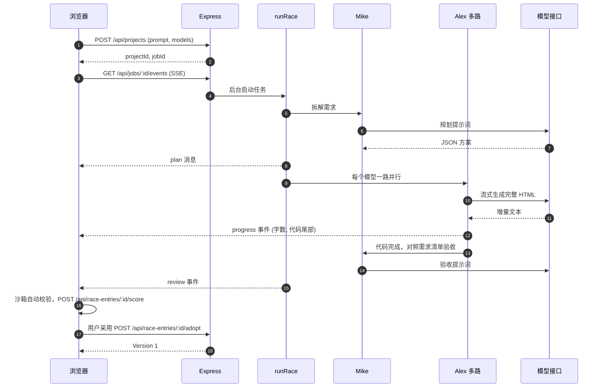

# Atoms Demo 说明文档

本文按笔试要求分为三部分：实现思路与关键取舍、当前完成程度、继续投入时的扩展计划，最后附评估维度对照和接口、数据表清单。文中的功能描述均对应仓库中的实际代码，未实现的内容会明确标注。

- 在线地址：<https://atoms-demo-i0h8.onrender.com>
- 代码仓库：<https://github.com/dong161/atoms-demo>
- 运行与部署方式见 [README.md](../README.md)

## 目录

1. 实现思路与关键取舍
2. 当前完成程度
3. 如果继续投入时间
4. 评估维度对照
5. 附录：接口与数据表

---

## 1. 实现思路与关键取舍

### 1.1 对 Atoms 产品的理解与取舍

我把 Atoms 的核心体验理解为：用户用自然语言提需求，一个智能体团队分工完成产品到代码的过程，结果能立刻在网页里看到、操作、修改和发布。围绕这个体验，下面列出我对其主要能力的取舍。

| Atoms 的能力 | 本项目的做法 | 取舍原因 |
| --- | --- | --- |
| 智能体团队（产品、架构、工程、数据等多角色） | 只做两个角色的固定流水线：Mike 负责需求拆解与验收，Alex 负责编码 | 多智能体自由对话框架的调试成本高、结果不稳定。固定流水线每一步输入输出明确，可测试，也便于在界面上展示。首页上 Emma、Bob、David 三个头像只是装饰，没有对应的智能体逻辑 |
| 赛马模式（多模型并行） | 做了，最多 3 路模型并行，可选择具体模型，也可关闭赛马 | 这是最容易体现差异化、同时又能控制复杂度的能力：并行只是 `Promise.all`，价值在于后面的校验与择优 |
| App Viewer（实时预览与交互） | 沙箱 iframe 里直接运行生成的应用，支持桌面/手机视图、刷新、Console、新标签页打开，候选完成后有可交互的缩略预览 | 「可以真实操作」是题目的硬要求。生成过程中展示的是流式代码尾部和字数，而不是半成品页面，因为不完整的 HTML 无法稳定渲染 |
| 版本与回退 | 每次采用、回退都生成新版本；回退是复制旧版本为新版本，历史不丢 | 与「Restore」语义一致，且避免破坏性操作 |
| 发布 | 一键发布得到 `/s/<slug>` 链接，可更新发布；每个访客的数据独立保存 | 题目要求在线链接且可用，访客数据隔离避免互相污染 |
| 对话迭代 | 在当前版本上提修改要求，修改也可赛马；修改轮使用整份 HTML 重写 | 单文件应用体积小，整份重写比做代码补丁（diff）更稳 |
| 后端/数据库集成 | 不让生成的应用自己写后端；用 localStorage 替身把数据同步到平台的数据库 | 生成物保持单文件，数据持久化由平台托管，模型只需遵守一条规则 |
| Design 可视化点选编辑、Deep Research、自定义域名 | 未做 | 与「一句话生成、可视化展示、可迭代」的主流程相比优先级较低，见第 2.3 节 |

### 1.2 总体架构与一次生成的流程

整体是一个 Node.js 单进程服务加一个无构建的原生前端。架构图见 README。一次「创建项目」的时序如下：

几个关键设计点：

- 任务在服务端运行，不依赖浏览器连接。`JobHub`（`server/jobs.js`）在内存里缓冲任务事件，SSE 连接断开后重新订阅会回放事件（`from` 参数），进度类事件只保留每路最新一条，避免回放过长。
- 关键结果都落库：消息、赛马、每路候选的代码、错误、耗时、评分明细。刷新页面后，`GET /api/projects/:id` 返回完整状态和 `activeJobId`，前端据此续订事件流。
- 单路候选完成后，`runRace` 才决定下一步：只有一路成功时自动采用；多路成功时进入「review」状态，由用户择优，系统只给出推荐标记，不替用户决定。

### 1.3 技术选型理由

| 选择 | 理由 |
| --- | --- |
| Node.js + Express，依赖只有 `express` 与 `pg` | 笔试作品要易读易跑。没有 ORM、没有构建工具，评委 `npm install` 后即可运行 |
| 数据库适配层 `server/db.js`：线上 Postgres，本地 Node 内置 SQLite | 线上免费实例磁盘不持久，需要外部数据库（Neon）；本地不装任何东西就能跑。SQL 统一写 `$1` 占位符，SQLite 下自动转换，表结构一份，两种库行为一致（含把 Postgres 的 BIGINT 转成数字） |
| 前端原生 ES Modules，无框架无构建 | 页面状态集中在一个 `state` 对象，复杂度可控；省去构建链路，部署只需 `npm ci` |
| SSE 而非 WebSocket | 事件流是单向的（服务端推送进度），SSE 更简单，前端用 fetch 读取并自行重连、回放，反向代理友好（响应头里关闭了缓冲） |
| OpenAI 兼容的 chat/completions 流式接口 | 事实标准，可接 DeepSeek、通义、OpenRouter 或自建网关。模型清单、规划模型都由环境变量配置，换模型不改代码 |
| 生成物限定为单文件 HTML | 可直接在 iframe 的 `srcdoc` 中运行，便于沙箱隔离、校验、下载、版本存储（一个版本就是一段文本）。不需要构建与多文件管理 |
| 为每个智能体准备 mock 实现 | 没有模型配置、模型失败、CI 测试都能走完整流程；评委不配任何密钥也能运行 |
| Render + Neon | 免费、可公开访问、有 `render.yaml` 可复现；用 GitHub Actions 保活与跑测试 |

### 1.4 评分设计

赛马的意义在于「择优」，因此打分必须能拉开差距。评分满分 100，由三部分组成（`public/js/sandbox.js` 的 `scoreReport`）：

| 部分 | 分值 | 评分项与规则 | 执行位置 |
| --- | --- | --- | --- |
| 沙箱实测 | 50 | 页面渲染 10（文字多于 40 字且元素多于 15 个得满分）；运行无报错 10（每个报错扣 4 分）；真实交互 15（5 分起，按抽测点击中产生页面变化的比例加至 15，没有可交互控件为 0）；数据持久化 10（交互后有写入存储 10 分，只读不写 5 分）；移动端适配 5（375px 宽无横向滚动） | 浏览器，离屏 iframe |
| 需求覆盖 | 40 | Mike 对照需求清单逐条验收，满足项占比乘以 40；验收失败或未执行时按一半（20 分）计 | 服务端调用模型，结果在浏览器合成总分 |
| 代码完整性 | 10 | 服务端静态检查：有 `<!DOCTYPE html>`、以 `</html>` 结尾、有标题、有 viewport、有脚本、内容长度，扣分制 | 服务端 `staticCheck` |

沙箱探针（`public/js/runtime.js` 的 `runProbe`）的做法：在离屏 iframe 里加载应用，往最多 6 个可见输入框填入样例数据，再依次点击最多 8 个可交互控件，用 MutationObserver 和页面文本长度变化判断控件是否有响应，同时统计 localStorage 的读写和 JS 报错；随后把 iframe 宽度改成 375px，测量是否出现横向滚动。探针模式下会把 `alert/confirm/prompt` 替换为无操作，并且不向云端同步数据。

排序规则：总分高者靠前，同分则耗时短者靠前；只有当所有候选都完成并打完分、且候选多于一个时，才显示「推荐」。

这个设计来自一次真实的教训（见 1.7 的第 1 条）：最初只有沙箱实测，三路结果几乎都满分，无法择优，所以加入了「Mike 对照需求逐条验收」这一项，并把权重设为 40。

### 1.5 数据持久化与安全隔离设计

**生成的应用如何持久化。** 提示词规定生成应用用 `localStorage` 保存数据。但预览 iframe 的 sandbox 属性没有 `allow-same-origin`，应用既拿不到平台的登录态，也没有自己可持久的存储。于是 `runtime.js` 作为 `<head>` 中的第一个脚本注入应用，用一个 `localStorage` 替身接管读写：

1. 宿主页（`sandbox.js` 的 `mountPreview`）先从云端读出该项目的数据，作为初始数据放进 `window.__ATOMS_INIT__`；
2. 应用对 `localStorage` 的写入由替身收集，300 毫秒内合并为一次 `postMessage` 发给宿主页；
3. 宿主页用登录用户的令牌调用 `POST /api/projects/:id/kv` 写入 `app_kv` 表。令牌始终留在宿主页，应用代码接触不到。

`sessionStorage` 替身只存在于内存。数据按「项目 + 作用域」存储：所有者的预览使用 `owner` 作用域；发布页的每位访客使用 `visitor:<访客ID>` 作用域，访客 ID 由访客浏览器生成（`/api/share/:slug/kv?visitor=...`，格式限定为 8 到 64 位字母数字、下划线或连字符）。因此访客之间、访客与所有者之间的数据互不可见。

**沙箱隔离。**

- iframe 的 sandbox 为 `allow-scripts allow-forms allow-modals allow-popups allow-popups-to-escape-sandbox allow-downloads`，不含 `allow-same-origin`，生成的代码运行在不透明源下，读不到平台页面的 DOM、Cookie、localStorage。
- 宿主与 iframe 之间的消息带随机的 channel，宿主只接受来自该 iframe 的 `contentWindow` 且 channel 一致的消息。
- 运行时拦截应用内的链接跳转，外链改为新窗口打开；拦截表单提交，防止整页导航把预览跳走。
- 前端渲染用户和模型文本时统一经过 `esc` 转义；注入脚本时对 `<` 和行分隔符做转义（`safeJson`）。

**账号与访问控制。** 支持邮箱密码注册（随机盐 scrypt）与7天会话登录，也保留昵称模式。昵称模式服务端生成 24 字节随机令牌，该令牌既是登录凭证也是换设备的恢复码。项目、版本、候选、任务、应用数据的访问都按「项目属于当前用户」校验，访问他人资源返回 404（有测试覆盖）。公开访问的只有 `/api/share/:slug` 与其 kv 接口。

**资源上限。** 请求体 2MB；需求描述 2000 字；单个项目同时只允许一个进行中的任务（返回 409）；赛马最多 3 路；应用数据每个作用域最多 200 个键，单条值最多 200000 字符。

### 1.6 稳定性设计

| 风险 | 对策 | 位置 |
| --- | --- | --- |
| 模型流中途断开，内容被截断 | 流结束时若没有出现 `finish_reason`，视为中断（`partial`），可重试，整段重新生成 | `server/llm.js` |
| 模型无输出或长时间无输出 | 单次调用总时限 180 秒，空闲 60 秒无数据即中止并重试 | `server/llm.js` |
| 429、5xx、网络错误 | 带退避的一次重试；只在可重试错误且未收到内容（或属于中断）时重试 | `streamChatWithRetry` |
| 模型输出不是完整文档 | `htmlProblem` 检查是否有 `<html>`、是否以 `</html>` 结尾、是否有脚本；不通过则整段重新生成，最多 2 次尝试，仍失败则该路标记失败 | `server/agents.js` |
| 模型输出带 markdown 围栏或说明文字 | `extractHtml` 去围栏、取 HTML 文档、裸片段自动补全文档骨架 | `server/html.js` |
| 某一路失败 | 各路互不影响，其它路照常完成；失败路在界面上显示原因 | `server/jobs.js` |
| 首轮全部失败 | 用演示数据兜底，并在候选卡片上标注「已用演示兜底」，保证流程能走完 | `runRace` |
| 修改轮全部失败 | 不使用演示数据冒充修改结果，保留当前版本，提示用户重试 | `runRace` |
| Mike 规划或验收调用失败 | 规划退化为 mock 方案并标注「演示数据」；验收失败则该项按一半计分，并在界面给出提示 | `agents.js` |
| 浏览器刷新、断线 | 任务继续在服务端运行；前端重新拉取状态并重新订阅 SSE，事件按序号回放；SSE 每 15 秒发送心跳 | `index.js`、`app.js` |
| 进程重启 | 启动时把遗留的 `running` 状态标记为失败，避免界面一直转圈 | `createApp` |
| 用户主动停止 | `POST /api/jobs/:id/cancel`，通过 AbortController 中止所有路，已完成的部分保留 | `index.js`、`jobs.js` |
| 推理模型首个 token 前思考很久，界面像卡住 | 界面每秒刷新「模型正在思考方案，已用时 N 秒」 | `app.js` |
| 免费实例休眠 | GitHub Actions 每 10 分钟请求 `/api/health`，失败重试 3 次 | `.github/workflows/keepalive.yml` |

### 1.7 开发中踩过的坑与修复

1. **三路结果沙箱分数都是 100，拉不开差距。** 最初的评分只看渲染、报错、交互、持久化、适配，这些对「能跑起来」的应用几乎都通过，赛马失去意义。修复：加入 Mike 对照需求清单逐条验收的环节（40 分），评价「做对了没有」而不只是「能不能跑」。线上用 3 路模型生成「番茄钟」的实测中，Mike 的验收分别为 5/5、5/5、4/5，差距由此体现。
2. **推理模型在首个 token 前要思考几十秒，界面像卡住。** 流式界面一开始没有任何输出。修复：在没有收到代码时显示「模型正在思考方案，已用时 N 秒」，并说明推理型模型会先思考再输出。
3. **上游流中途断开，导致修改版本被截断却被采用。** 连接异常结束时流读取是「正常结束」，拿到的是半截 HTML，却被当作成功结果。修复分三层：流结束时没有 `finish_reason` 就视为中断并重试；缺少 `</html>` 或脚本的结果视为不完整，重新生成；修改轮全部失败时不再用演示数据冒充，保留当前版本。对应测试：「没有 finish_reason 就结束的流视为中途断开」「输出中途断开后整段重来，并通知 onReset」。
4. **上游某个模型因出口地区被拒（提示 User location is not supported）。** 这属于外部环境问题，无法在代码里修复。结果是赛马里其它路正常完成并胜出，用户无感知，体现了多路并行带来的容错。
5. **生成的应用在无 `allow-same-origin` 的 sandbox 中运行，拿不到平台登录态，也没有持久的 localStorage。** 修复：注入 localStorage 替身，并用 postMessage 把数据交给宿主页同步到云端（见 1.5）。

### 1.8 复杂度控制

- 智能体只有两个角色、两个固定步骤，不引入编排框架。
- 生成物只有单文件 HTML，没有构建、多文件和依赖管理。
- 前端没有框架和构建；后端只有两个运行时依赖。
- 账号支持邮箱密码或昵称加恢复码；不提供邮箱验证、邮件找回或OAuth。
- 评分在浏览器里执行：浏览器本来就有渲染引擎，不需要在服务器安装无头浏览器，免费实例也能承受。代价见 2.3 节。
- 所有外部依赖（数据库、模型）都有降级方案：本地用 SQLite，没有模型用 mock。

---

## 2. 当前完成程度

### 2.1 已完成

| 模块 | 已实现内容 | 主要代码 |
| --- | --- | --- |
| 账号与初始化 | 首页主动触发可关闭的登录/注册弹窗；邮箱密码与昵称注册；三步初始化引导；设备令牌即恢复码，账号菜单可复制恢复码、退出登录；恢复码登录；令牌失效时提示重新登录 | `public/js/app.js`、`server/index.js` |
| 项目管理 | 创建、列表（含版本号与「已发布」标记）、重命名、删除（连带版本、候选、应用数据） | `server/index.js` |
| 需求拆解 | Mike 输出应用名、概述、功能清单、设计、数据，对话里以卡片展示；失败时退化为 mock 方案 | `server/agents.js` |
| 多模型赛马 | 1 到 3 路并行；界面可开关赛马并选择模型；每路实时显示字数、代码尾部、耗时；候选卡片有可交互缩略预览 | `server/jobs.js`、`public/js/app.js` |
| 自动校验与验收 | 沙箱实测、Mike 需求验收、静态检查，合成 100 分；展开可看每一项得分与依据；支持「重新校验」 | `public/js/sandbox.js`、`runtime.js` |
| 采用 | 多路时用户择优采用，同一轮里可以改选另一个候选（生成新版本）；单路成功时自动采用 | `server/jobs.js` |
| 应用查看器 | 沙箱预览；桌面/手机视图（偏好记在本机）；刷新；Console 面板（收集 log、warn、error、未捕获异常，并在按钮上显示错误数）；清空应用数据；新标签页打开；下载单文件 HTML | `public/js/app.js` |
| 对话迭代 | 在当前版本上修改，提示词要求保留未改动的功能和 localStorage 键名；修改可赛马；可中途停止 | `server/index.js`、`server/agents.js` |
| 版本管理 | 版本历史抽屉；预览任意历史版本；一键回退（生成新版本）；对话中的版本卡片 | `server/index.js`、`public/js/app.js` |
| 数据持久化 | localStorage 替身加云端同步；刷新、换设备保留；所有者与每位访客各自独立 | `public/js/runtime.js`、`server/index.js` |
| 发布与分享 | 发布固定当前版本；链接稳定，可「更新发布」；公开页顶部有「用 Atoms Demo 做一个」入口 | `server/index.js`、`public/share.html` |
| 稳定性 | 见 1.6 | 多处 |
| 演示模式 | 无模型配置时自动启用，三个内置模板按关键词路由；两路赛马使用不同主色，使对比有区别；支持简单修改（换主色、深色模式） | `server/agents.js`、`server/mock/` |
| 响应式界面 | 工作台在窄屏下用「对话 / 预览」两个标签切换 | `public/css/style.css`、`app.js` |
| 部署与工程化 | Render 与 Neon 在线部署；`/api/health` 健康检查；GitHub Actions 保活与自动测试 | `render.yaml`、`.github/workflows/` |

### 2.2 题目要求逐项对照

| 题目要求 | 对应实现 |
| --- | --- |
| 可运行的网页应用，类似 Atoms | 在线地址可直接访问，本地一条命令运行 |
| 一句话描述，智能体驱动生成代码 | 首页输入框与示例；Mike 加 Alex 的流水线 |
| 以可视化网页实时展示 | SSE 实时进度、代码流式输出、沙箱预览、赛马对比 |
| 真实交互 | 生成的应用在沙箱中可直接操作；规定了「所有按钮都要能用」并在评分中实测 |
| 数据持久化 | 平台数据库保存账号、项目、版本、对话、候选；生成应用的数据同步到 `app_kv` |
| 基本流程（初始化、注册、主流程） | 登录/注册、三步引导、创建、生成、采用、迭代、回退、发布 |
| 至少一个延展能力 | 多模型赛马加自动校验打分；另有版本回退、发布分享、下载 |
| 在线链接 | 见文首 |
| 可用而非 PoC | 错误处理、重试、断线续传、权限校验、测试、部署保活（见 1.6） |

### 2.3 没有做的内容与原因

| 未做或有局限 | 原因与说明 |
| --- | --- |
| 多智能体自由对话框架 | 刻意不做。只保留 Mike 与 Alex 两个角色的固定流水线，换取稳定性和可测试性。首页的 Emma、Bob、David 头像仅为装饰 |
| 多文件工程与构建 | 生成物限定为单文件 HTML，不支持 React 工程、npm 依赖、构建 |
| 后端能力（生成应用自带 API、登录） | 生成的应用只有前端；数据靠 localStorage 同步。无法生成需要服务端逻辑的应用 |
| Design 可视化点选编辑 | 未做。目前修改只能通过对话；点选元素需要在 iframe 内建立元素到源码的映射，成本较高 |
| Deep Research、自定义域名 | 未做，与主流程关联较弱 |
| 流式过程中渲染半成品页面 | 未做。生成过程中展示字数和代码尾部，完成后才渲染 |
| 密码、邮箱、找回账号 | 已支持邮箱密码与昵称加恢复码。邮箱未验证所有权、不支持邮件找回；昵称账号恢复码丢失则无法找回。邮箱密码经随机盐 scrypt存储，新登录会话有效期7天。数据库只存令牌的 SHA-256（早期明文账号在下次登录时自动升级）；令牌保存在浏览器 localStorage，设备共用时存在风险 |
| 评分的可信度 | 沙箱探测在浏览器端执行，结果由浏览器上报到 `POST /api/race-entries/:id/score`，服务端只做范围限制，不能防篡改。评分用于辅助择优，不用于权限、计费等决策 |
| 评分的覆盖面 | 探针只抽测至多 8 个控件，不理解业务逻辑；Mike 的验收是模型判断，可能误判；没有视觉质量评分 |
| 限流与配额 | 已有内存限流：每用户每小时最多 30 次生成、每 IP 每小时最多注册 20 个账号、分享页访客数据写入每分钟 120 次；再加上模型网关的并发上限与模型白名单。局限：限流在进程内存里，多实例或重启后不共享；访客 ID 可任意构造，长期运行还需要访客数据的过期清理 |
| 生成代码的网络访问 | 预览与发布页在注入运行时的同时注入 CSP（`default-src 'none'`，只允许内联脚本/样式与 data/blob 资源），生成的代码无法发起任何网络请求，用户数据不会被外传。代价是生成的应用不能调用外部 API |
| SSE 鉴权 | 前端用 `fetch` 读取事件流，令牌放在 `Authorization` 请求头里；服务端不接受 URL 中的令牌，避免进入访问日志 |
| 多实例部署 | 任务状态（JobHub）保存在进程内存，目前只适合单实例；进程重启会中断进行中的任务（已标记为失败，不会一直转圈） |
| 单次调用时限 | 单次模型调用上限 180 秒、空闲上限 60 秒，极慢的模型会被判为超时 |
| 演示模式的局限 | 只有三个内置模板；与模板关键词不匹配的需求（如示例里的「喝水打卡」）会回落到看板模板；修改只支持换主色和深色模式 |
| 模型网关的可用性 | 线上模型经作者本机网关接入。网关不可用时，首轮生成会用演示数据兜底，修改会失败并提示重试 |
| 测试覆盖 | 61 个自动化测试覆盖智能体解析、HTML 清洗与检查、模型客户端、全部主要接口；浏览器端的沙箱探针与评分、前端交互、Postgres 适配层没有自动化测试，靠手动与线上验证 |

### 2.4 验证情况

- 自动化测试：`npm test` 共 61 个，全部通过。agents 12 个、api 10 个、html 13 个、llm 10 个、初始数据规则回归 1 个、auth 5 个（邮箱注册/登录、字段哈希、失效会话与旧库迁移）、keepalive 4 个（冷启动HTML、异常状态、重试、超时）。api 测试使用内存 SQLite 加 mock 模型，端到端走通：注册与鉴权、创建项目与双路赛马、打分并采用、单路修改自动采用、回退、发布与访客数据隔离、跨用户访问被拒、SSE 事件流（URL 带令牌被拒）、取消发布后链接失效、令牌不以明文入库。llm 测试用本地假服务模拟 500、400、空内容、中途断开等情况。
- 线上验证：用 3 路模型赛马生成「番茄钟」，83 秒完成，Mike 验收分别为 5/5、5/5、4/5；随后完整走通采用、修改、发布，并确认分享页访客的数据隔离。
- CI：push 到 main 与 pull request 触发测试（Node 22）；另有每 10 分钟一次的线上健康检查。

---

## 3. 如果继续投入时间

按「对用户价值 ÷ 实现成本」排序，并标注是否影响可靠性。

### P0：优先补齐，成本低、价值高

| 事项 | 价值 | 成本 |
| --- | --- | --- |
| 限流计数持久化（Redis / 数据库），支持多实例 | 当前限流在进程内存，扩容或重启后失效 | 低 |
| 受控的外部数据能力（平台代理的白名单 API） | CSP 禁止外联后，生成应用无法取实时数据；由平台代理少量白名单接口可以安全地放开 | 中 |
| 访客数据清理与总量上限 | 避免公开数据接口被灌满数据库 | 低 |
| 评分服务端复核 | 让评分不可篡改，也为后续在服务端批量评估打基础（见 P1） | 中：需要无头浏览器，免费实例资源紧张，可作为独立 worker |

### P1：提升生成质量与体验，是下一阶段重点

| 事项 | 价值 | 成本 |
| --- | --- | --- |
| 修改轮使用代码补丁而不是整份重写 | 降低 token 消耗和耗时，减少「改一处，别处被改坏」 | 中：需要让模型输出 diff 或区块替换，并做应用失败时的整份重写降级 |
| 自动修复循环：把探针的报错和验收未通过项反馈给 Alex，自动再改一轮 | 把「评分」变成「质量闭环」，直接提升交付质量；这是赛马之后最自然的扩展 | 中：复用现有评分，加一个带上限的迭代 |
| 流式渲染：在 HTML 逐步完整时增量刷新预览 | 实时展示更接近 Atoms 的体验 | 中：需要判断文档何时可安全渲染，避免闪烁和报错 |
| Design 点选编辑：在预览中点选元素，生成针对该元素的修改要求 | 对非技术用户的修改门槛显著降低 | 中到高：运行时里记录元素路径并传回宿主，再拼成修改提示 |
| 评分的可配置与可解释：每项得分依据可视化，权重可调 | 帮助用户理解为什么推荐某一路，也便于调参 | 低到中 |
| 项目与版本的导出、导入，版本对比（diff 视图） | 数据可迁移，回退前能看清差异 | 中 |
| 前端关键路径的自动化测试（Playwright） | 覆盖探针、评分与工作台主流程，降低回归风险 | 中 |

### P2：产品延展

| 事项 | 价值 | 成本 |
| --- | --- | --- |
| 多智能体扩展：增加产品（Emma）、架构（Bob）等角色，把方案评审放进流水线 | 向 Atoms 的团队形态靠拢，复杂需求的方案质量更高 | 高：需要角色间协议、失败处理和成本控制，应在补齐自动修复之后再做 |
| 多文件工程与受控依赖（例如预置的组件库白名单） | 支持更复杂的应用 | 高：需要构建与沙箱方案 |
| 生成应用的后端能力（受限的服务端函数或托管数据表） | 支持多用户共享数据的应用 | 高：涉及安全模型、配额与隔离 |
| 邮箱验证与找回、第三方登录、团队协作与分享权限 | 在现有邮箱密码登录上完善账号体系 | 中到高 |
| 自定义域名、发布历史 | 完整的发布能力 | 中 |
| Deep Research | 需求调研与素材收集 | 中到高，价值取决于场景 |
| 多实例部署：任务状态与事件迁移到共享存储（数据库或消息队列） | 水平扩展，进程重启不丢任务 | 中到高 |

---

## 4. 评估维度对照

| 评分维度 | 对应的设计与实现 |
| --- | --- |
| 完成度 | 题目列出的流程全部走通：初始化、注册、生成、实时展示、真实交互、持久化、发布；有在线链接，61 个测试通过，线上做过完整验证（第 2.2、2.4 节） |
| 工程思维 | 用固定的两角色流水线替代多智能体框架；单文件 HTML、无构建前端、双数据库适配、评分放在浏览器，都是有意的复杂度取舍；取舍与未做事项在文中主动交代；踩坑记录与修复都有对应测试（第 1.3、1.7、1.8、2.3 节） |
| 用户体验 | 实时进度与代码流、「思考中，已用时」提示、赛马对比与推荐、可交互缩略图、全屏试用、手机视图与 Console、断线自动续上、版本回退不丢历史、示例一键填入、窄屏适配（第 1.6、2.1 节） |
| 创新性 | 赛马加「沙箱实测加 AI 需求验收」的混合评分，让多模型结果可比较、可解释；localStorage 替身加 postMessage 同步，让单文件应用在严格沙箱里也能云端持久化，并按访客隔离（第 1.4、1.5 节） |
| 可交付性 | README 说明三分钟体验路径、架构、运行与部署；不配置密钥也能运行；`.env.example` 与 `render.yaml` 可复现部署；CI 自动测试；本文档说明思路、局限与规划 |

---

## 5. 附录：接口与数据表

### 5.1 接口

除标注「公开」外，接口都需要 `Authorization: Bearer <令牌>`（事件流也只接受此请求头，不接受 URL 中的 `token`）。

| 方法与路径 | 说明 |
| --- | --- |
| `GET /api/health` | 公开。健康检查，返回数据库类型与是否演示模式 |
| `GET /api/config` | 公开。是否演示模式、可选模型、默认赛马阵容、最大并行数 |
| `POST /api/auth/register` | 公开。昵称+邮箱+密码，随机盐scrypt，返回用户与恢复码 |
| `POST /api/auth/login` | 公开。邮箱+密码，签发7天会话令牌；登录限流 |
| `POST /api/users` | 公开。昵称注册，返回用户与令牌 |
| `GET /api/me` | 当前用户 |
| `GET /api/projects`、`POST /api/projects` | 项目列表；创建项目并启动首轮生成 |
| `GET/PATCH/DELETE /api/projects/:id` | 项目详情（含对话、版本、赛马、候选）；重命名；删除 |
| `POST /api/projects/:id/messages` | 在当前版本上提修改要求，启动修改任务 |
| `GET /api/jobs/:id/events` | SSE 事件流，支持 `from` 回放 |
| `POST /api/jobs/:id/cancel` | 停止任务 |
| `GET /api/race-entries/:id/html` | 候选代码 |
| `POST /api/race-entries/:id/score` | 上报沙箱评分 |
| `POST /api/race-entries/:id/adopt` | 采用候选，生成新版本 |
| `GET /api/versions/:id/html` | 版本代码 |
| `POST /api/versions/:id/restore` | 回退（复制为新版本） |
| `POST /api/projects/:id/publish` | 发布当前版本，返回 `/s/<slug>` |
| `GET /api/share/:slug` | 公开。发布版本的代码 |
| `GET/POST /api/projects/:id/kv` | 所有者的应用数据读取与写入（支持 `set`、`del`、`clear`） |
| `GET/POST /api/share/:slug/kv?visitor=...` | 公开。访客的应用数据读取与写入 |

页面路由：`/` 工作台（哈希路由 `#/p/<项目ID>`）、`/s/:slug` 发布页、`/preview` 所有者新标签预览。

### 5.2 数据表

| 表 | 内容 |
| --- | --- |
| `users` | 用户、恢复码哈希、可空邮箱与密码哈希 |
| `sessions` | 登录会话哈希与7天有效期 |
| `projects` | 项目、方案（`plan`）、当前版本、已发布版本、分享标识 |
| `versions` | 版本代码、序号、来源模型、评分 |
| `messages` | 对话（用户、Mike、Alex、系统；含方案、赛马、版本卡片等类型） |
| `races` | 一次赛马（一次生成或修改）及采用结果 |
| `race_entries` | 每一路候选：代码、状态、错误、耗时、评分明细 |
| `app_kv` | 生成应用的云端数据，按项目与作用域（`owner` 或 `visitor:<ID>`）隔离 |

启动时通过 `CREATE TABLE IF NOT EXISTS` 自动建表。

### 首页视觉补验

参考官网人物与设计示例，明确标注来源、非官方和非本站生成；不复制官方业绩。已在本地真实浏览器验证注册→三步初始化→填入提示→创建mock项目→退出→邮箱登录找回同一项目；390px宽无横向溢出、所有13处图片正常加载。首页视觉动效支持prefers-reduced-motion。素材详见素材来源.md。线上发布与Postgres迁移需以部署后证据为准。

### GitHub 保活（2026-10-09）

`.github/workflows/keepalive.yml` 每5分钟尽力访问 Render 的 `/api/health`，错开整点，保留手动触发并在保活配置变化时立即执行。脚本不仅检查HTTP成功，还要求JSON `ok=true`、数据库postgres；避免把Render返回HTTP200的唤醒页面误报健康。失败最多重试3次，单请求60秒、间隔10秒；任务5分钟超时，只读仓库权限。

GitHub schedule可能延迟或丢弃，**不能保证永不休眠**。Render免费实例15分钟无流量会休眠，唤醒约1分钟；免费运行时数为工作区共享750小时/月。持续保活会消耗运行额度。可靠免冷启动需另选常驻服务方案，本项目未自动购买付费实例。

## 新增：生成主题与附件
输入框现在提供精简加号菜单、五种主题（含默认自由创作）和文本附件。主题进入模型系统提示并应用 CSS，附件以 JSON 参考资料进入创建和修改请求，项目数据库持久化保存。前后端均限制附件扩展名、数量、字符数、字节数、空文本与二进制控制字符。允许 TXT/MD/JSON（按文本处理），不支持图片/PDF；明确提示附件会发送给模型。
新增 6 项测试覆盖校验、主题 CSS 与存储键保留、不可信参考资料封装、HTTP 模型请求捕获以及创建/采用/修改的完整 API 流程；总计 61 项。
